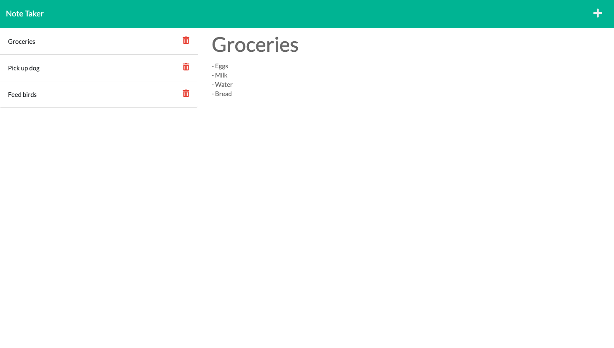
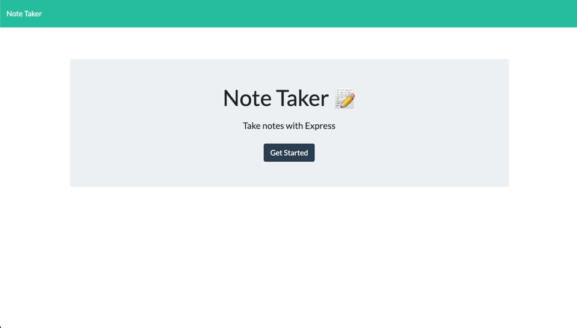

# Notetaker

## Description 

A simple application made for a user to take notes by receiving input, saving the note, viewing notes, deleting them. This was developed using both front-end, and back-end code. 

## Table of Contents
* [Links](#links)
* [Technologies](#technologies)
* [Usage](#usage)
* [Screenshots](#screenshots)
* [Demo](#demo)

## Links 

Heroku: 
Local: See [Usage](#Usage) for local setup instructions 

## Technologies

* HTML
* CSS / Bootstrap
* Javascript
* Node.js
* Express.js
* FS Node.js module
* Heroku 

## Usage 

* If you do not have `Node.js` installed, [click here](https://nodejs.org/en/) to download and install. 
* While in a terminal within the root directory of the application, run the command `npm install` to install the required modules/packages. 
* Once this finishes, run `npm start` or `node server.js`. 
* Open your web browser, and type `http://localhost:3000/` in the URL bar. 
* When you are finished using, go to the terminal and click `ctrl + c` on your keyboard. 

## Screenshots

## Demo

